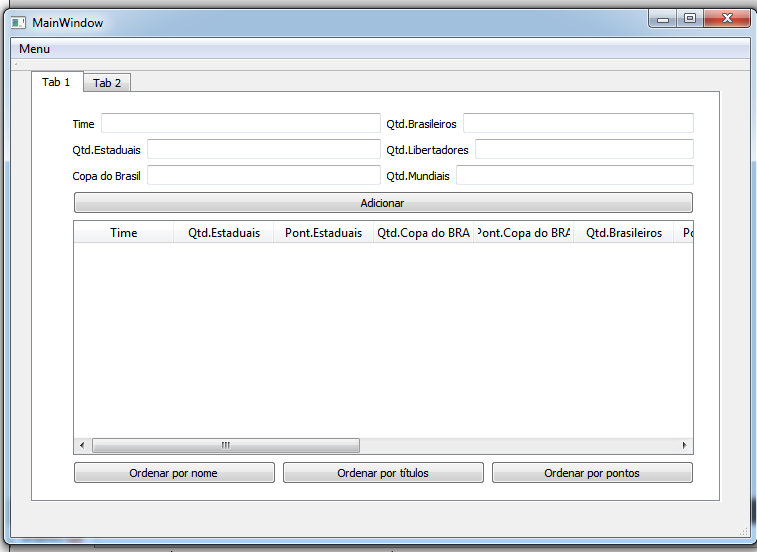
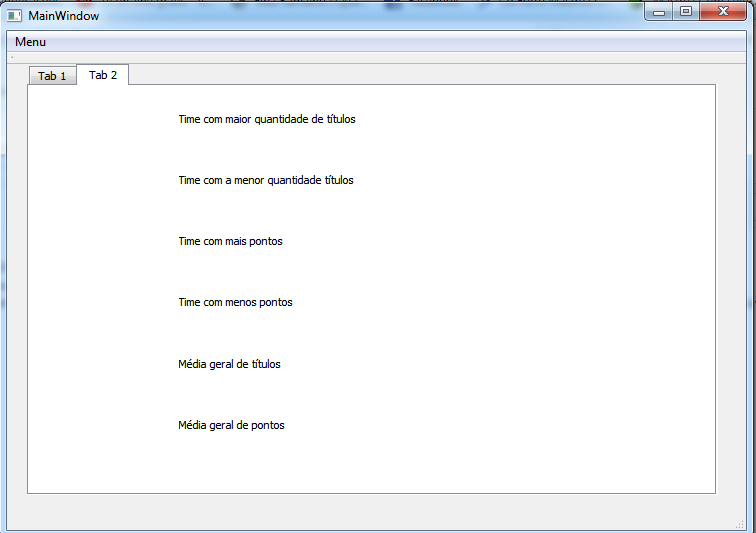
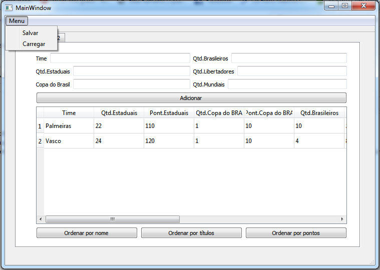

# Futebol
Tabeladetítulos
## Introdução
Esse projeto é feito para cadastrar times do futebol brasileiro e seus títulos, depois de cadastrado, é feito um calculo da pontuação do time de acordo com sua quantidade de títulos e relevância dos títulos.
## Cadastrando 
 Aqui é simples, você pega qualquer time brasileiro, cadastra ele em "time"(coloca o nome do seu time) e em Qtd(Quantidade), colocamos quantos titulos esse time tem em cada item, por exemplo Qtd.Brasileiro vc coloca quantos títulos brasileiro seu time tem e para os outros da mesma forma, depois é feito um calculo dando a pontuação do seu time e a quantidade total de títulos que tem seu time. É válido ressaltar que, qualquer time que seja tem que ter pelo menos um título caso contrário o cadastro será invalidade, assim como colocar numeros negativos em qualquer título, porque nenhum time tem -1 estadual,é legal que é só pegar os dados do seu time e os títulos que vc consegue comparar qual teve mais títulos e qual foi a relevânci, além de ver quem é o melhor, pelo menos no quesito ganhar muitos campeonatos relevantes. Depois de cadastrar os times você também pode ordenalos, por ordem alfabética(Ordenar por nome), por quantidade de títulos na forma decrescente e por pontos na forma descrescente. Para isso é valido dizer que vc deve ter pelo menos dois times já cadastrados e que para ordenar basta apenas apertas os botões com nome altamente sugestivo que é, "Ordenar".

## Estatística 
Mudando para o tab 2, você encontra dados estatístico da sua tabela, nesse aba vc indentifica o time com mais título, assim como o que tem menos títulos, o time com mais pontos e o time com menos pontos, além de verificar a média geral de títulos e pontos dos times cadastrado na tabela. 

## Ultimos passos
Por fim, você pode salvar os dados de tabelas que vc já criou indo no nome "Menu" e clicando com o botão esquerdo do seu mause, e então terás uma tabela com todos os itens listados nela, caso depois queira ver nessa mesma tabela novamente esses dados é só, carregar , que vc encontra tbm em menu. como de acordo com a imagem abaixo.

## Finalidade do pprojeto
Principal finalidade é, acabar a discussão de qual time é melhor, porque para ver isso, basta apenas cadastrar os times, e o programa fará todo trabalho para você!!!É isso aí, e independente de qualquer aplicativo o Vasco sempre será o melhor time para mim.
